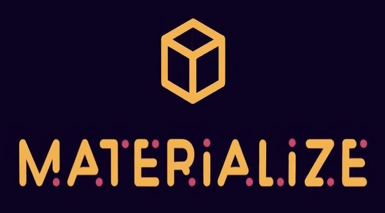

# Materialize - Fighting Fake Production on the OriginTrail DKG
## Fighting Fake Fabrication with AI + Blockchain

Materialize is a decentralized manufacturing layer that connects digital assets (NFTs, 3D models, licenses) with **real-world production**, verified and logged on the **OriginTrail Decentralized Knowledge Graph (DKG)**.

We demonstrate how the DKG’s **Agent Layer → Knowledge Layer → Trust Layer** can be used to verify the fabrication of a physical object, creating “Proof-of-Make” — a new trust primitive for manufacturing.

This repository contains:
- A fork of the DKG Edge Node (with added manufacturing schema)
- A functional UI for selecting NFTs and triggering fabrication
- A working AI Fabrication Agent using MCP
- JSON-LD structured proofs
- Full architecture documentation
- Submission video (5 minutes)
- Demo CNC implementation (“Reverse RWA → Physical Pendant”)

---

# 🌍 1. Problem & Motivation

Modern manufacturing suffers from:

### ❌ Counterfeiting  
Fake industrial components cost global manufacturers **hundreds of billions** yearly  
and compromise safety and reliability.

### ❌ Broken supply chains  
Spare parts arrive late, cost more to ship than to produce locally,  
and are frequently unavailable when needed.

### ❌ Zero transparency  
Consumers and manufacturers cannot trust where objects come from  
or whether the part was produced according to the design.

### ❌ Idle machines  
Millions of 3D printers, CNC machines, and engravers sit under-utilized globally.

### ❌ No unified protocol for machine-verified manufacturing  
There is no standardized way for machines to produce verifiable outputs.

---

# 🟨 2. What Materialize Does


Materialize ties **digital ownership** to **verified physical creation**.

### ✔ Digital asset (e.g., NFT)  
→ becomes a **manufacturing blueprint**

### ✔ Machine produces object  
→ and generates a **machine log**

### ✔ AI Agent builds JSON-LD  
→ and writes **Proof of Make** to the DKG

### ✔ DKG Trust Layer anchors  
→ to Polkadot/NeuroWeb for global verifiability

The result:  
**A real-world object with a verifiable, tamper-proof origin.**

---

# 🏗 3. System Architecture

Materialize uses all 3 layers of the OriginTrail stack.

## **A. Agent Layer (MCP)**
The Fabrication Agent performs:
- Knowledge Assets retrieval
- Manufacturing param generation
- Publishing to DKG

📄 Documentation: [`architecture/agent.md`](https://github.com/miodragstrak/materialize/blob/master/architecture/system-overview.md)

---

## **B. Knowledge Layer (DKG + JSON-LD)**

📄 Example JSON-LD files: [`examples/`](https://github.com/miodragstrak/materialize/tree/master/examples)

---

## **C. Trust Layer (NeuroWeb / Polkadot)**
The DKG anchors:
- timestamp  

📄 Documentation: [`architecture/system-overview.md`](https://github.com/miodragstrak/materialize/blob/master/architecture/system-overview.md)

---

# 🧱 4. Repository Structure

```
materialize-dkg/
│
├── my_dkg_node/
│   │
│   └── dkg-node/               ← forked DKG node
│
├── materialize-ui/             ← Materialize UI (NFT → Maker → Object)
│
├── agents/                     ← MCP agent logic
│
├── examples/                   ← JSON-LD fabrications
│
├── architecture/               ← diagrams and docs
│
├── tokenomics/                 ← early protocol economics
│
├── video/                      ← demo video (≤ 5 minutes)
│
└── picture/                    ← screenshots
```

---

# 🧩 5. Setup Instructions

## **A. DKG Node**

### Install dependencies:

```
cd my_dkg_node/dkg-node
dkg-cli run-dev
```

The agent communicates with:
- UI   
- DKG node  

---

## **B. Materialize UI**

### Install:

```
cd materilize-ui
npm run dev
```

# 🛠 6. Demo Instructions

## 1. Start DKG node  
(in `my_dkg_node/dkg-node/`)

```
dkg-cli status (check if all services are running)
```

## 2. Start UI  
(in `materialize-ui/`)

```
npm run dev
```

## 3. Open browser:  
`http://localhost:3000`

## 4. Publish - Creating the initial Manufacturing Knowledge Asset (KA)

- Enter product details
- Click “Generate Manufacturing KA Prompt”
- Copy the generated prompt


- Paste the prompt into the MCP Fabrication Agent
- Press Enter
- The agent publishes the MaterializePoMManufacture KA
- A new UAL appears


- Copy the UAL
- Paste it into the “Generate QR” section
- A QR code linked to the Manufacturing KA is generated


### 5. Update - Adding installation or lifecycle information

- Enter installation details
- Click “Generate Installation KA Prompt”
- Click Copy Prompt


- Paste the prompt into the agent
- Press Enter
- The agent publishes a new VerificationEvent KA
- A new UAL appears, referencing the previous KA


### 6. Verify - Checking authenticity and location

- Upload or choose a picture of the QR code containing the UAL
- Enter claimed location
- Click Generate Verification Prompt
- Copy the prompt


- Paste the verification prompt into the agent
- Press Enter
- The agent fetches the original KA from the DKG
- Compares claimed location with ground-truth metadata


---

# 🧾 7. JSON-LD Structured Examples

Examples included:

- [`examples/publish.jsonld` ](https://github.com/miodragstrak/materialize/blob/master/examples/publish.jsonld) 
- [`examples/update.json` ](https://github.com/miodragstrak/materialize/blob/master/examples/update.jsonld) 
- [`examples/verify.json`](https://github.com/miodragstrak/materialize/blob/master/examples/verify.jsonld)

All located in:  
📁 [`/examples`](https://github.com/miodragstrak/materialize/tree/master/examples)

---

# 🔗 8. x402 Integration

Not implemented in this prototype.

---

# 📊 9. Early Tokenomics

Located in:  
📁 `tokenomics/`

Tokenomics part will cover:
- Maker node earning model  
- Proof-of-Make transaction fees  
- License royalties  
- Token incentives for DePIN participation  

---

# 👤 10. Team

**Nenad Dimitrovski** - CNC / Open Source Engineer  
**Miodrag Strak** - Product, Strategy & Architecture

---

# 🎥 11. Submission Video  
(found in: `/video/demo.mp4`)

---

# 🔥 12. Summary

Materialize creates verifiable, decentralized manufacturing by connecting real machines (CNC, laser, 3D printers) with AI agents and the OriginTrail DKG. Every object produced receives a proof of production, intallation and verification, stored as Knowledge Assets on the DKG and linked through a scannable QR code.

Our demo shows how a digital design becomes a physical object while the agent publishes, updates, and verifies the lifecycle on-chain.

Materialize is the first step toward Decentralized Manufacturing - a global network of verified machines producing real-world objects on demand, with trust, provenance, and transparency built in.